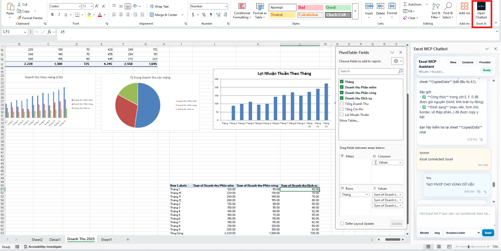

# Excel MCP Chatbot Add-in

Add-in Excel dạng task pane để chat trực tiếp với workbook đang mở và gọi các tool từ `excel-mcp-server`.

## Hình ảnh minh họa

Chatbot chạy trực tiếp trong Excel, có thể đọc workbook hiện tại, tạo pivot/chart và phản hồi ngay trong task pane.



## Tính năng chính

- Mở chatbot ngay trong Excel bằng nút `Open Chatbot` trên ribbon.
- Đọc context workbook hiện tại qua Office.js: workbook, sheet, active cell, selected range.
- Kết nối MCP Excel tools, gồm các tool thao tác file Excel và `run_python` để xử lý linh hoạt.
- Cấu hình provider/model trực tiếp trong giao diện chatbot, không cần sửa file config thủ công.
- Hỗ trợ nhiều provider OpenAI-compatible như 9Router, Gemini, OpenRouter, GLM, Alibaba/Qwen, DeepSeek, Groq...
- Server local chạy HTTPS tại `https://localhost:3100`.
- Có script autostart để server tự chạy khi đăng nhập Windows.

## MCP Excel tools đang dùng

Add-in này không chỉ là giao diện chat. Phía sau nó gọi trực tiếp các tool của `excel-mcp-server`, nên agent có thể vừa hiểu yêu cầu tự nhiên vừa thao tác workbook bằng tool có cấu trúc.

### Workbook và worksheet

- `create_workbook`: tạo workbook Excel mới.
- `create_worksheet`: thêm worksheet mới.
- `copy_worksheet`: nhân bản worksheet trong cùng workbook.
- `rename_worksheet`: đổi tên worksheet.
- `delete_worksheet`: xóa worksheet.
- `get_workbook_metadata`: đọc metadata, danh sách sheet và cấu trúc workbook.

### Đọc, ghi và di chuyển dữ liệu

- `read_data_from_excel`: đọc dữ liệu từ một range, có kèm metadata validation nếu có.
- `write_data_to_excel`: ghi mảng dữ liệu vào worksheet.
- `copy_range`: copy một vùng cell sang vị trí khác.
- `delete_range`: xóa nội dung một vùng cell.
- `validate_excel_range`: kiểm tra range có hợp lệ không trước khi thao tác.

### Định dạng và bố cục sheet

- `format_range`: format range: font, màu nền, màu chữ, border, alignment, wrap text, number format, conditional format...
- `merge_cells`: merge một vùng cell.
- `unmerge_cells`: bỏ merge.
- `get_merged_cells`: liệt kê các vùng cell đang merge.
- `insert_rows`, `insert_columns`: chèn dòng/cột.
- `delete_sheet_rows`, `delete_sheet_columns`: xóa dòng/cột.

### Công thức, bảng, biểu đồ và pivot

- `apply_formula`: ghi công thức Excel vào cell.
- `validate_formula_syntax`: kiểm tra cú pháp công thức trước khi áp dụng.
- `create_table`: tạo Excel Table có style.
- `create_chart`: tạo chart như column/bar/line/pie/scatter...
- `create_pivot_table`: tạo Pivot Table từ vùng dữ liệu.

### Data validation và Python linh hoạt

- `get_data_validation_info`: đọc rule data validation trong worksheet.
- `run_python`: chạy Python tùy ý với helper `openpyxl`, `load_workbook`, `json`, `Path`, `resolve_path`, `save_workbook`, `read_json`, `write_json`.

`run_python` là escape hatch quan trọng: khi tool cố định chưa đủ, agent có thể viết Python ngắn để xử lý logic phức tạp, hoặc dùng `win32com.client` để thao tác workbook đang mở trong Excel desktop.

Ví dụ các việc agent có thể làm qua MCP:

- Tạo sheet báo cáo mới, copy dữ liệu, format header và thêm công thức tổng hợp.
- Tạo biểu đồ doanh thu, thêm legend, chỉnh style và đặt chart vào vị trí mong muốn.
- Tạo Pivot Table từ vùng dữ liệu hiện có.
- Dọn dữ liệu: xóa dòng/cột thừa, chuẩn hóa format số, kiểm tra range.
- Đọc workbook hiện tại rồi viết Python xử lý custom khi cần.

## Cấu trúc nhanh

```text
excel-chatbot-addin/
  public/                    Giao diện task pane Office Add-in
  server/                    Express server, provider store, chat service
  scripts/                   Script smoke test MCP
  manifest.xml               Office Add-in manifest
  setup-excel-sideload.ps1   Cấu hình trusted shared-folder catalog cho Excel
  start-excel-chatbot.ps1    Chạy server nền tại localhost:3100
  stop-excel-chatbot.ps1     Dừng server nền
  install-autostart-task.ps1 Tạo Scheduled Task tự chạy server khi đăng nhập
```

## Yêu cầu

- Node.js 20+.
- Repo `excel-mcp-server` nằm cùng workspace:

```text
C:\Users\PHUC\Documents\Codex\2026-06-24\se\work\excel-mcp-server
```

- Office localhost certificate đã được trust. Nếu thiếu cert, chạy:

```powershell
npx office-addin-dev-certs install
```

## Cài đặt

```powershell
cd C:\Users\PHUC\Documents\Codex\2026-06-24\se\work\excel-chatbot-addin
npm install
```

Nếu Excel báo add-in bị chặn do certificate hết hạn hoặc không hợp lệ:

```powershell
.\renew-office-cert.ps1
.\start-excel-chatbot.ps1
```

## Chạy server

Chạy nền bằng helper script:

```powershell
cd C:\Users\PHUC\Documents\Codex\2026-06-24\se\work\excel-chatbot-addin
.\start-excel-chatbot.ps1
```

Kiểm tra server:

```powershell
curl.exe -k https://localhost:3100/health
```

Dừng server:

```powershell
.\stop-excel-chatbot.ps1
```

## Tự chạy sau khi restart máy

Đã có script tạo Windows Scheduled Task:

```powershell
cd C:\Users\PHUC\Documents\Codex\2026-06-24\se\work\excel-chatbot-addin
.\install-autostart-task.ps1
```

Task được tạo tên:

```text
ExcelMcpChatbotServer
```

Sau khi đăng nhập Windows, server sẽ tự chạy nền. Chỉ cần mở Excel rồi bấm `Open Chatbot`.

## Sideload vào Excel

Chạy script cấu hình trusted shared-folder catalog:

```powershell
cd C:\Users\PHUC\Documents\Codex\2026-06-24\se\work\excel-chatbot-addin
.\setup-excel-sideload.ps1
```

Sau đó trong Excel:

1. Restart Excel.
2. Mở workbook bất kỳ.
3. Vào `Home > Add-ins > Advanced`.
4. Chọn `SHARED FOLDER`.
5. Chọn `Excel MCP Chatbot` rồi bấm `Add`.
6. Dùng nút `Open Chatbot` trong group `Excel AI`.

## Cấu hình provider/model

Trong task pane:

1. Bấm `Provider`.
2. Chọn provider hoặc nhập custom provider.
3. Chọn API mode:
   - `OpenAI Responses API`: chỉ dùng cho OpenAI chính thức.
   - `OpenAI-compatible Chat Completions`: dùng cho Gemini, OpenRouter, Alibaba/Qwen, GLM, DeepSeek, Groq, 9Router...
4. Nhập `Base URL`, `API key`, `Model`.
5. Bấm `Save`.

Lưu ý:

- API key thật chỉ nhập trong giao diện local, không commit vào repo.
- Nếu ô key hiển thị dạng có `...` hoặc `*`, đó là key đã che, app sẽ không dùng chuỗi che đó để gọi API.
- Với Gemini nên dùng endpoint OpenAI-compatible:

```text
https://generativelanguage.googleapis.com/v1beta/openai
```

## Cách dùng chat

- Nhập yêu cầu vào ô chat rồi bấm `Send`.
- Paste ảnh/screenshot trực tiếp bằng `Ctrl+V`.
- Bấm `Img` nếu muốn chọn file ảnh từ máy.
- Bấm icon copy ở bubble để copy nội dung message.
- Bấm icon edit ở bubble user để đưa prompt cũ và ảnh cũ về composer rồi sửa/gửi lại.
- Bấm `Sessions` để mở lại các phiên chat đã lưu local.

## Ghi chú bảo mật

Các file sau không nên commit:

- `.provider-settings.json`: có thể chứa API key.
- `.certs/`: có private key HTTPS local.
- `.server-*.log`, `.server.pid`.
- `node_modules/`.

Các mục này đã được đưa vào `.gitignore`.

## Troubleshooting

Nếu mở Excel không thấy add-in:

```powershell
.\setup-excel-sideload.ps1
```

Sau đó restart Excel và vào lại `Home > Add-ins > Advanced > SHARED FOLDER`.

Nếu task pane mở nhưng không load:

```powershell
.\start-excel-chatbot.ps1
curl.exe -k https://localhost:3100/health
```

Nếu server đang chạy nhưng Excel vẫn giữ UI cũ, restart Excel để Office bỏ cache add-in cũ.

Nếu muốn kiểm tra manifest:

```powershell
npx office-addin-manifest validate manifest.xml
```
